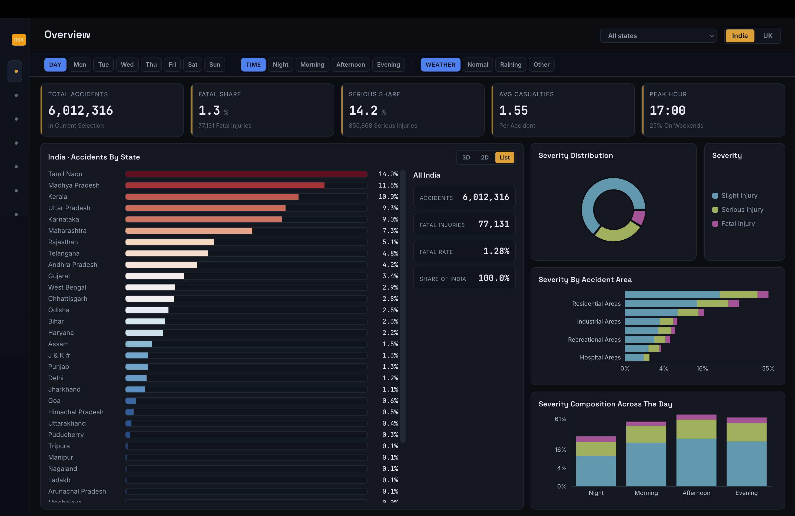
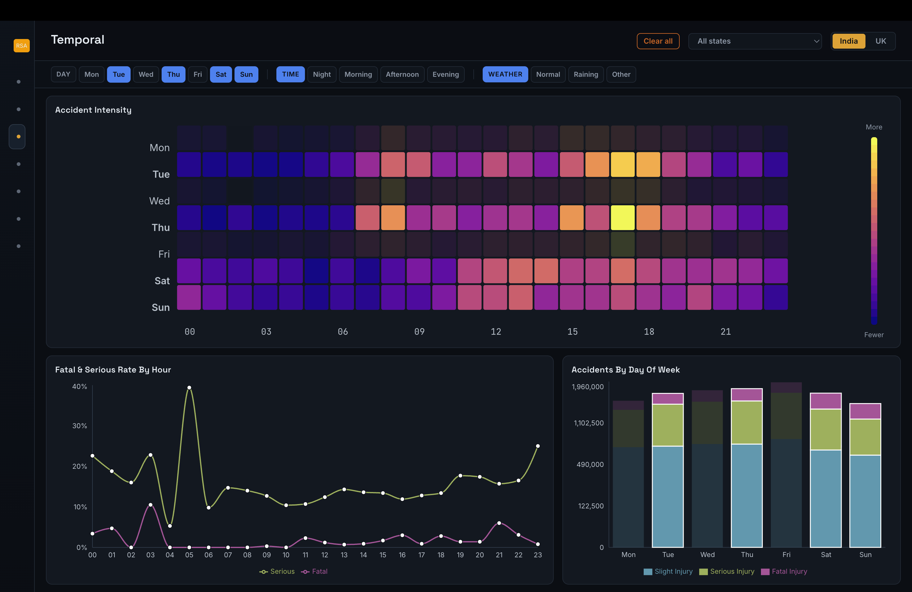
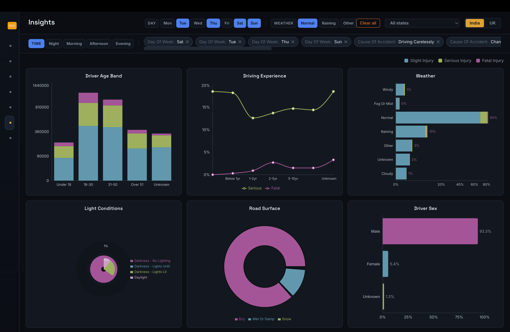
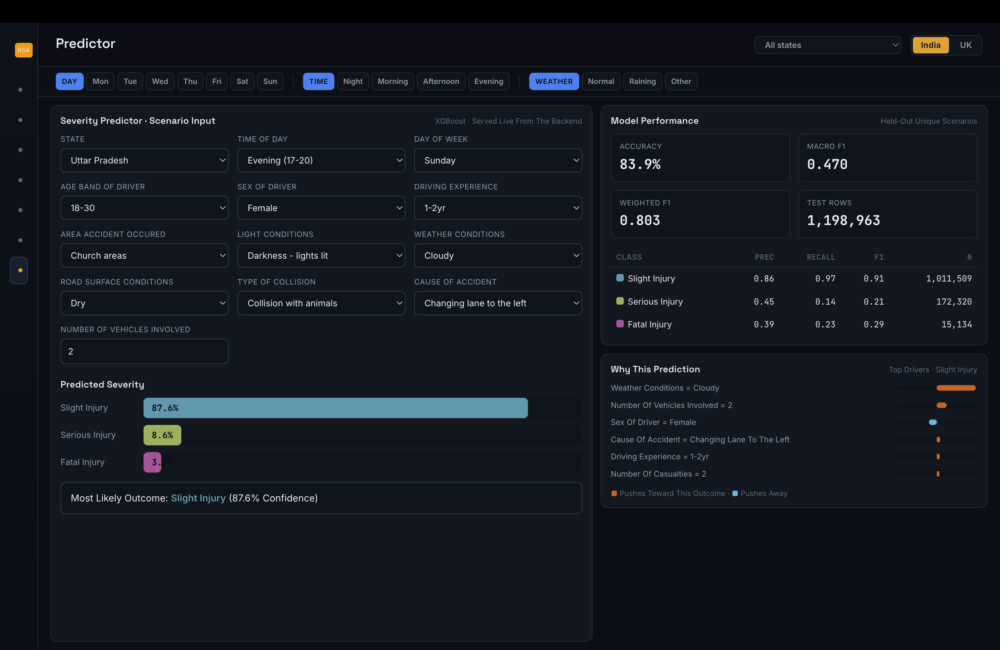

# Road Accident Analytics — CS661

An interactive visual analytics system for exploring road-accident volume, severity, temporal patterns, environmental conditions, causes, and hypothetical severity scenarios across India and the UK.

[](https://react.dev/)
[](https://fastapi.tiangolo.com/)
[](https://duckdb.org/)
[](https://xgboost.ai/)

> **Live Demo:** [Open Road Accident Analytics](https://road-accident-analytics-cs-661-bsl8h9l3v.vercel.app/)

## Project highlights

- **6,012,316 India runtime records**, **37 attributes**, and **3 severity classes**.
- **7 linked analytical views** with OR-within-field and AND-across-field cross-filtering.
- **25+ interactive visualizations**, including heatmaps, bubble maps, risk rankings, treemaps, scatterplots, radar profiles, and a State/UT choropleth.
- Fast aggregate queries over **7 compressed India Parquet partitions** using FastAPI and DuckDB.
- Weighted multiclass XGBoost predictor with **14 model inputs**, PCA, and **450 depth-3 trees**.
- Current India evaluation: **85.9% accuracy**, **0.5756 Macro-F1**, and **0.8265 Weighted-F1** on **1,204,047 weighted test records**.

## Screenshots

| Overview | Temporal analysis |
|---|---|
|  |  |

| EDA and insights | Severity predictor |
|---|---|
|  |  |

The screenshots above are taken from the final project report and show the
linked dashboard views, filters, EDA comparisons, and live severity prediction
interface.

## Analytical views

| View | What it provides |
|---|---|
| Overview | Headline KPIs, severity distribution, accident area, time of day, and State/UT context |
| Geospatial | Area bubbles, risk ranking, road surface, lanes/medians, and vehicle classes |
| Temporal | Day × hour crash intensity, hourly severity rates, and weekday distribution |
| Causal | Accident causes, collision types, and rare-but-deadly categories |
| Patterns | Cramér's V associations, risk fingerprint, cause treemap, and casualty distribution |
| EDA | Driver age, sex, experience, weather, lighting, and road-surface comparisons |
| Predictor | Slight/Serious/Fatal probabilities, metrics, and local feature contributions |

## Technology stack

- **Frontend:** React, Vite, Recharts, D3
- **Backend:** FastAPI, DuckDB, pandas
- **Storage:** Zstandard-compressed Parquet and JSON metadata
- **Machine learning:** scikit-learn, PCA, XGBoost, joblib

## Local installation

### Prerequisites

- Python **3.9+**
- Node.js **18+**
- npm
- macOS only: install OpenMP using `brew install libomp`

### 1. Clone the repository

```bash
git clone https://github.com/MrRahul2003/Road_Accident_Analytics_CS661.git
cd Road_Accident_Analytics_CS661
```

### 2. Install and run the backend

```bash
python3 -m venv .venv
source .venv/bin/activate
pip install -r backend/requirements.txt
cd backend
uvicorn main:app --reload --port 8000
```

Verify the backend:

```text
http://localhost:8000/api/health
```

### 3. Install and run the frontend

Open another terminal in the repository root:

```bash
cd frontend
npm install
npm run dev
```

Open the URL printed by Vite, normally:

```text
http://localhost:5173
```

The prepared runtime Parquet files and trained model pipelines are included, so normal use does not require rebuilding the data.

## Run after first-time installation

### Terminal 1 — backend

```bash
source .venv/bin/activate
cd backend
uvicorn main:app --reload --port 8000
```

### Terminal 2 — frontend

```bash
cd frontend
npm run dev
```

## Production frontend build

```bash
cd frontend
npm install
npm run build
npm run preview
```

The generated frontend is written to `frontend/dist/`.

## Deployment: Render backend + Vercel frontend

The complete project remains in one GitHub repository. Render runs the
FastAPI/DuckDB service, while Vercel builds the React frontend from
`frontend/`.

### 1. Deploy the backend on Render

1. Push this repository to GitHub.
2. In Render, select **New + → Blueprint** and connect the repository.
3. Render detects `render.yaml`; approve the `road-accident-analytics-api` service.
4. Wait for deployment, then open:
   `https://YOUR-RENDER-SERVICE.onrender.com/api/health`.
5. Copy the service URL without `/api/health`.

The repository already includes the required runtime Parquet and model files.

### 2. Deploy the frontend on Vercel

1. Import the same GitHub repository into Vercel.
2. Choose **Vite** as the framework preset.
3. Set **Root Directory** to `frontend`.
4. Keep **Build Command** as `npm run build` and **Output Directory** as `dist`.
5. Add this environment variable for Production, Preview, and Development:

   ```text
   VITE_API_BASE=https://YOUR-RENDER-SERVICE.onrender.com
   ```

6. Click **Deploy**.

### 3. Restrict backend access after Vercel deploys

In Render, add the environment variable below and redeploy the service:

```text
FRONTEND_ORIGINS=https://YOUR-PROJECT.vercel.app
```

For multiple allowed Vercel domains, use a comma-separated value. Replace the
live-demo placeholder at the top of this README with the final Vercel URL.

## Main API endpoints

| Endpoint | Purpose |
|---|---|
| `GET /api/health` | Backend and dataset health |
| `GET /api/meta` | Metadata and categorical levels |
| `GET /api/kpis` | Filtered headline metrics |
| `GET /api/agg` | Grouped severity counts and rates |
| `GET /api/matrix` | Two-dimensional heatmap aggregates |
| `GET /api/association` | Cramér's V association scores |
| `GET /api/conditions` | Condition-level Serious-or-Fatal comparisons |
| `POST /api/predict` | Severity probabilities and local contributions |

## Predictor pipeline

```text
14 model fields
    ↓
One-hot encoding
    ↓
PCA retaining 95% variance
    ↓
XGBoost: 150 rounds × 3 classes = 450 trees
    ↓
P(Slight), P(Serious), P(Fatal) + top feature contributions
```

The India model uses **12 categorical fields**, including State, and **2 numerical fields**. It was trained from scratch; no pretrained model was used.

### Current India model results

| Metric | Value |
|---|---:|
| Accuracy | 85.90% |
| Macro-F1 | 0.5756 |
| Weighted-F1 | 0.8265 |
| Train combinations | 251,026 |
| Test combinations | 62,757 |
| Weighted test records | 1,204,047 |

| Severity class | Precision | Recall | F1 |
|---|---:|---:|---:|
| Slight Injury | 0.871 | 0.979 | 0.922 |
| Serious Injury | 0.653 | 0.189 | 0.293 |
| Fatal injury | 0.558 | 0.473 | 0.512 |

## Optional: rebuild data and models

Install the pipeline packages:

```bash
pip install -r scripts/data_pipeline/requirements.txt
```

Rebuild the India runtime dataset and model:

```bash
python3 scripts/data_pipeline/india/clean_generated.py --source generated
python3 scripts/data_pipeline/india/build_runtime_dataset.py
python3 scripts/data_pipeline/india/train_severity_model.py
```

Rebuild the UK runtime dataset and model:

```bash
python3 scripts/data_pipeline/uk/build_runtime_dataset.py
python3 scripts/data_pipeline/uk/train_severity_model.py
```

## Data note

The India runtime corpus is a balanced empirical expansion of **12,316 cleaned source records**. It preserves the source distribution for scalability testing but does not represent 6.01 million independent accidents. The `State` field was independently assigned using **MoRTH 2023** State/UT totals; State-level model effects should therefore be interpreted cautiously.

## Repository structure

```text
Road_Accident_Analytics_CS661/
├── backend/                    # FastAPI and DuckDB API
├── frontend/                   # React/Vite dashboard
├── data/runtime/               # Prepared Parquet data and trained pipelines
├── scripts/data_pipeline/      # Cleaning, preparation, and training scripts
├── docs/screenshots/           # README images
├── Road_accident_analysis_Report.pdf
├── big data analytics.pptx
└── run.txt
```

## Mentor

**Prof. Soumya Datta — CS661**
